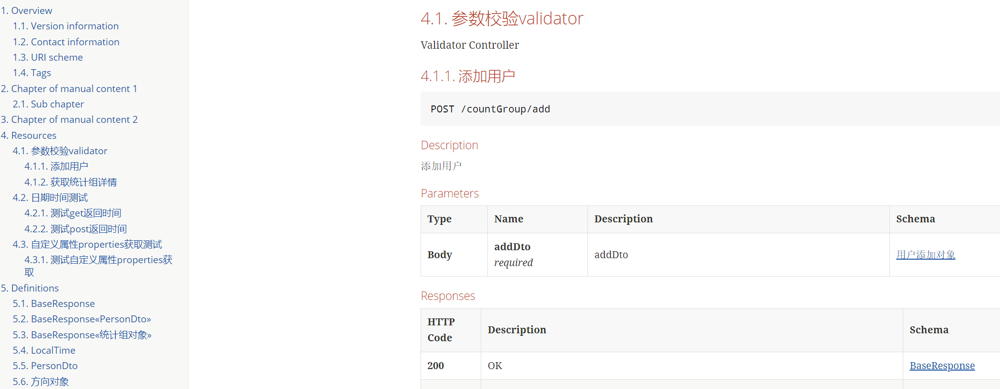

= Swagger2Markup Demo

== Overview

This project is a https://github.com/RobWin/swagger2markup[Swagger2Markup] (AsciiDoc and GitHub Flavored Markdown) converter demo using https://github.com/spring-projects/spring-boot[Spring Boot], https://github.com/springfox/springfox[springfox] and https://github.com/spring-projects/spring-restdocs[spring-restdocs].
The demo shows how to generate static docs (HTML5 and PDF) with the https://github.com/RobWin/swagger2markup-gradle-plugin[swagger2markup-gradle-plugin] .

See https://github.com/RobWin/swagger2markup[Swagger2Markup] and https://github.com/Swagger2Markup/spring-swagger2markup-demo[spring-swagger2markup-demo] for more details and usage guide.

== Usage guide
=== Maven

如果想生成HTML或者PDF文档，请先修改io.github.robwin.swagger2markup.petstore.Swagger2MarkupTest里的
注意这个接口必须要返回swagger的json数据，一定自己先验证下

[subs="attributes"]
----
private static final String SWAGGER_URL = "http://localhost:8085/v2/api-docs";
----

然后运行:

[source,groovy]
----
mvn clean test
----

最后可以在 `target/asciidoc/html` and `target/asciidoc/pdf`找到HTML和PDF文档

== Screenshot

